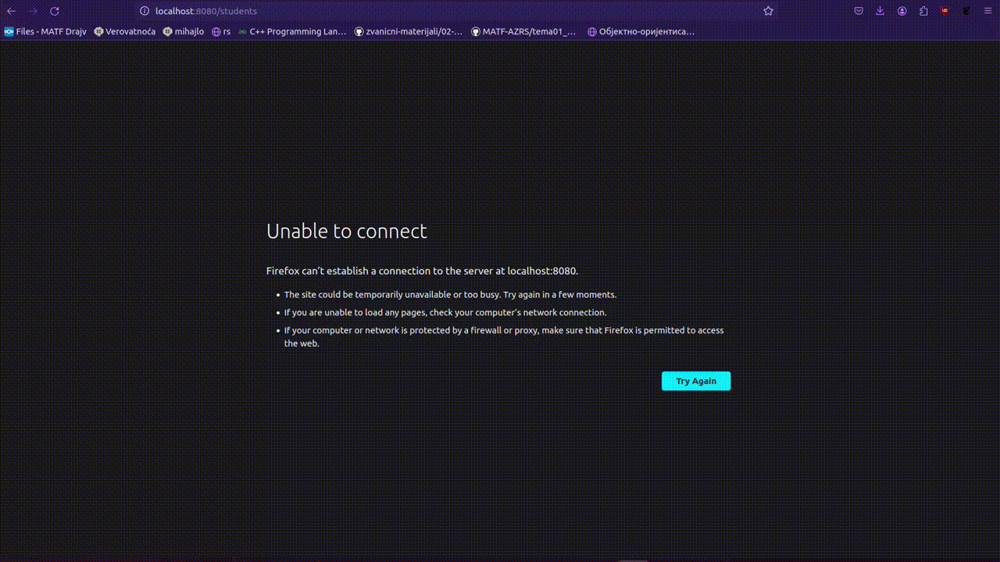

# Student management system 📝

**Student management system is web application that allows storing, updating and deleting
information about students. Used technology: JavaSpringBoot(back), Thymeleaf(front),
MySQL(database).**


## Screenshots 🎯
Gif snimak rada aplikacije:



## Technologies :wrench:
- **MySql-database**
- **SpringBoot backand**
- **Thymeleaf frontend**

## Setup :pencil2:
U terminalu:
```
$ git clone https://github.com/lukamileticc/Student-Management-System.git
```
Zatim je potrebne preuzeti [Spring tool suite(STS 4)](https://vpsie.com/knowledge-base/how-to-install-spring-tool-suitests-4-in-ubuntu/)

Konfigurisati java runtime enviroment(jre): JavaSE-17(jre)
```
run-> run configurations -> jre tab -> select jre
```
Otvoriti STS4 i otvoriti preuzeti direktorijum kao projekat:
```
file -> open file ->select directory
```
Potrebno je imati MySQL(SUBP).
Aktiviranje mysql servisa i kreiranje baze podataka(sms - ime baze):
```
$ sudo service mysql start
$ sudo service mysql status
$ sudo mysql -u root
$ create database sms;
```
Pre pokretanja potrebno je prilagoditi podesavanja aplikacije(konfigurisati MySql bazu):

File: /Student-Management-System/src/main/resources/application.properties
```
spring.application.name=student_management_system
  #ovde konfigurisemo mysql-bazu podataka
  spring.datasource.url=jdbc:mysql://localhost:3306/sms?useSSL=false&serverTimezone=UTC&useLegacyDatetimeCode=false
  spring.datasource.username=
  spring.datasource.password=
  spring.datasource.driver-class-name=com.mysql.cj.jdbc.Driver
  #Hibernate properties 
  spring.jpa.properties.hibernate.dialect=org.hibernate.dialect.MySQL8Dialect
  #Hibernate auto ddl
  spring.jpa.hibernate.ddl-auto=update
  logging.level.org.hibernate.SQL=DEBUG
```
Zatim otvoriti file : 
/Student-Management-System/src/main/java/net/javaprojects/sms/StudentManagementSystem2Application.java

Desni klik na editor:
```
run as Spring Boot app
```
Otvoriti browser:
```
localhost:8080/students
```
